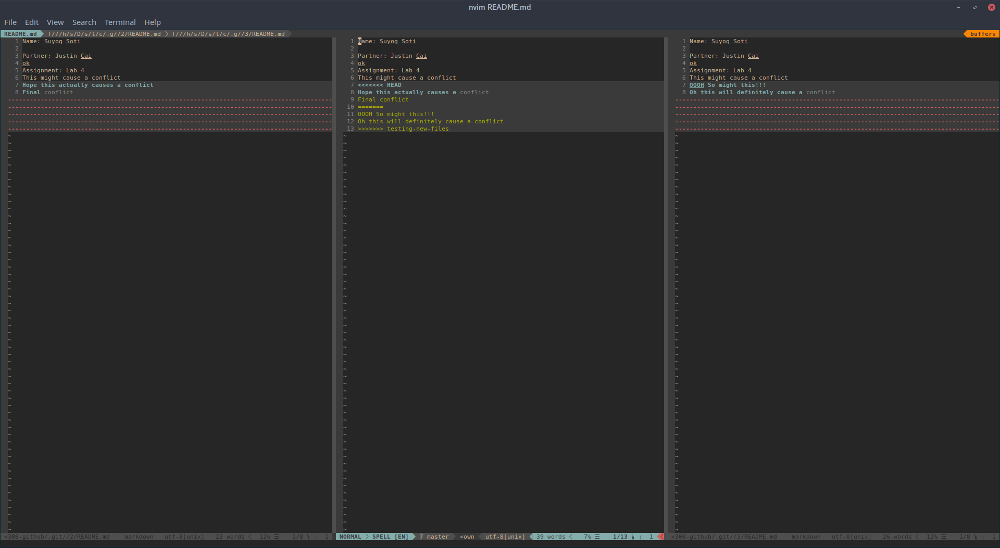

Name: Suyog Soti  
Partner: Justin Cai  
Assignment: Lab 4  

### I start the Assignment here
1. create repo online
1. make sure its public online
1. `git clone git@github.com:masterSoti/csci3308-github.git`
1. `vim README.md`
1. `git commit -am "added readme with name"`
1. `vim lol.py`
1. `git commit -am "added and committed a few more files"`
1. `git push`
1. `git tag v0.0.1`
1. `git push --tag`
1. `git checkout -b testing-new-files`
1. `vim secrets.txt`
1. `git commit -am "a few more files in the extra branch"`
1. `git checkout master`
1. `vim secrets2.txt`
1. `git commit -am "the second secrets file"`
1. `git merge testing-new-files`
1. `git checkout testing-new-files`
1. `vim secrets2.txt`
1. `git commit -am "second edit"`
1. `git push --set-upstream origin testing-new-files`
1. `git checkout master`
1. `git push`

### I am going to switch to partner repo here
1. partner is Justin Cai
1. Repo access granted online
1. `git clone git@github.com:jzc/gitlab`
1. `vim README.md`
1. `git commit -am "will cause conflict"`
1. `git push`

### Switched back to my own repo
1. `git checkout master`
1. `vim README.md`
1. `git commit -am 'some more conflict'`
1. `git pull`
1. `vim README.md`
1. `git commit -a`
1. `git push`

## The following is a picture of me resolving my conflicts

